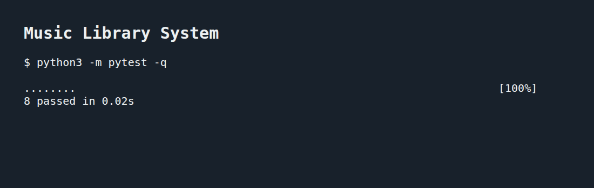

# Music Library System

A Python class that stores a song's name, artist, and genre. Creating a song updates the total count, unique artists and genres, and song counts for each artist and genre.

## Run the tests

```bash
python3 -m venv .venv
source .venv/bin/activate
pip install pytest==7.1.3
pytest -q
```

This lab uses Python; no npm packages are required.

## Example

Run from the project folder:

```python
from lib.song import Song

Song("Halo", "Beyonce", "Pop")
Song("Love on Top", "Beyonce", "Pop")
Song("99 Problems", "Jay Z", "Rap")

print(Song.count)          # 3
print(Song.artists)        # ['Beyonce', 'Jay Z']
print(Song.genres)         # ['Pop', 'Rap']
print(Song.genre_count)    # {'Pop': 2, 'Rap': 1}
print(Song.artists_count)  # {'Beyonce': 2, 'Jay Z': 1}
```

The constructor calls all five class methods to update the library. Artists and genres appear once, in the order they were added. Counts are shared across song objects and last for the current Python process. `artist_count` is also maintained for compatibility with the starter tests.

## Test results


